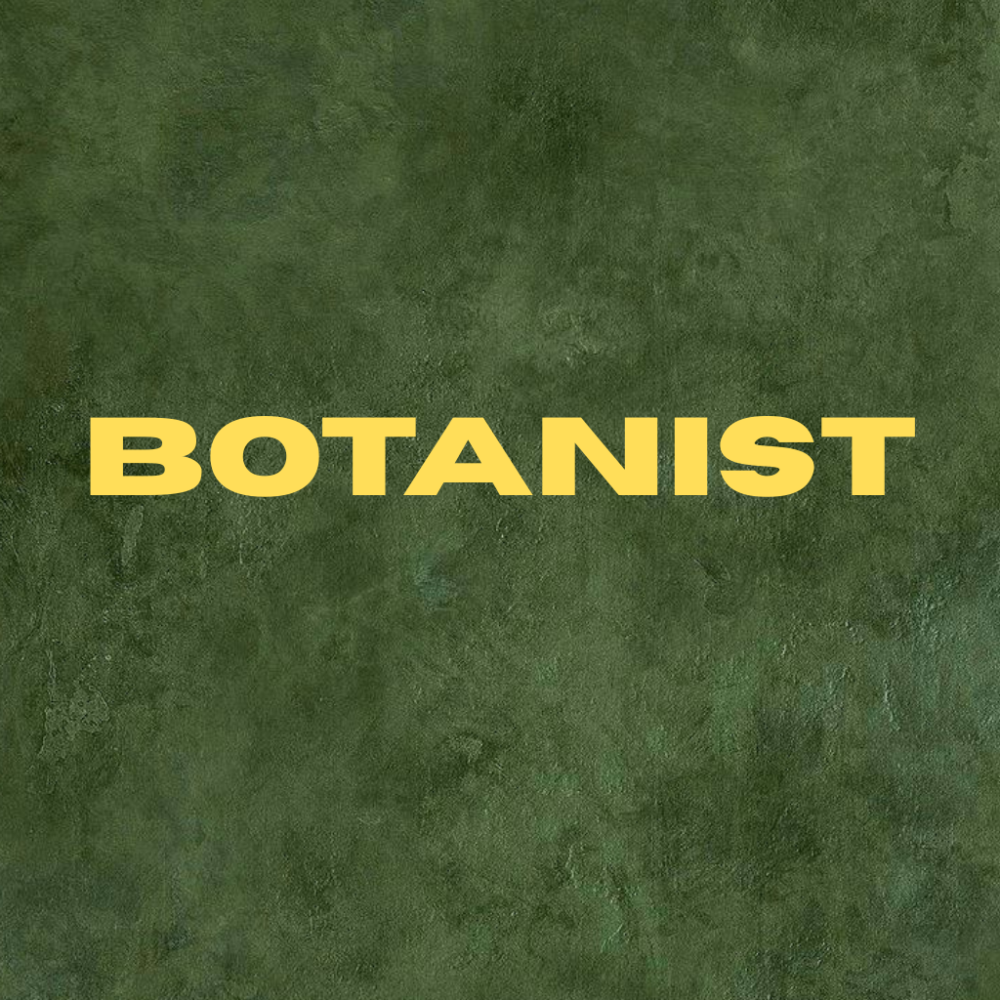

     

# Botanist

Botanist is a mobile application that identifies plants using images.
Users can take a photo or upload an image, and the app shows the type of plant along with basic details.
The app focuses on simplicity, privacy, and on-device AI, making plant identification easy and accessible.

---

🛠 Tech Stack

Frontend

React Native

Expo

TypeScript

Expo Router

React Native Paper

AI / ML

TensorFlow Lite

Pre-trained image classification model

Device Features

Expo Camera

Image Picker

AsyncStorage